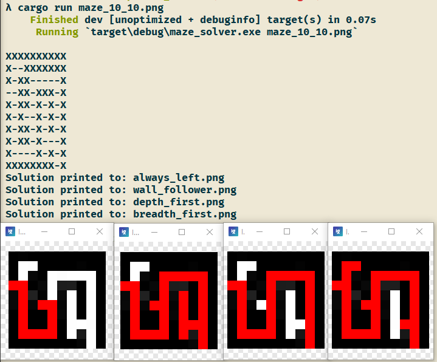

# Maze Solver

Four algorithms implemented:
 * Always go left
 * Wall follower
 * Breadth First Search
 * Depth First Search

Give the program an image as an argument, it will solve it and output it. (Check src/main.rs)\
I might do more in the future.

There are also other things like:
 * Turning a maze into an adjacency list
 * Turning a maze into a two-dimension array
 * Printing a maze to the terminal

# Example Output

